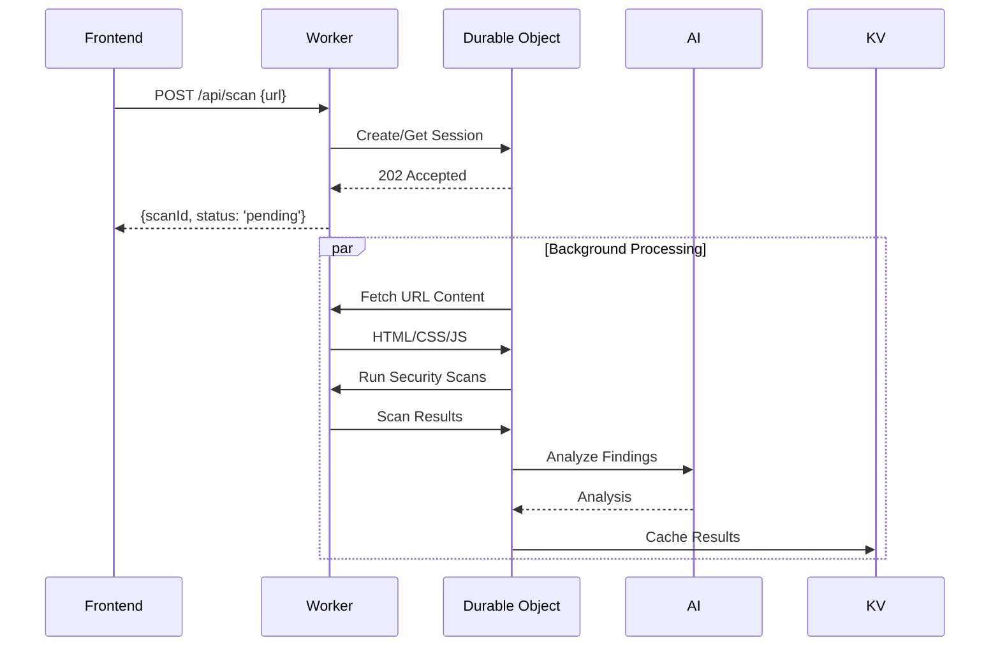
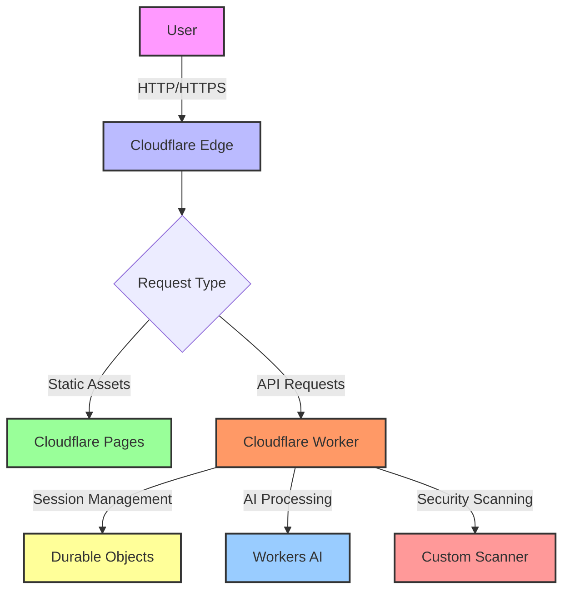

# AI Security Scanner Chat - Technical Deep Dive

## Table of Contents
1. [Architecture Overview](#architecture-overview)
2. [Cloudflare Integration](#cloudflare-integration)
   - [Workers](#cloudflare-workers)
   - [Durable Objects](#durable-objects)
   - [Workers AI](#workers-ai)
3. [Data Flow](#data-flow)
4. [Security Considerations](#security-considerations)
5. [Scalability & Performance](#scalability--performance)
6. [Error Handling & Resilience](#error-handling--resilience)

## Requirements Coverage Analysis

### 1. LLM Integration (Llama 3.3 on Workers AI)
**Implementation Status**: ✅ Fully Implemented
- **Core Integration**:
  ```typescript
  // In src/ai/chat.ts
  const aiResult = await env.AI.run('@cf/meta/llama-3.3-70b-instruct-fp8-fast', {
    messages: [{
      role: 'system',
      content: 'You are a security expert analyzing website vulnerabilities.'
    }, {
      role: 'user',
      content: sanitizePrompt(userMessage)
    }],
    max_tokens: 2000,
    temperature: 0.3
  });
  ```
- **Key Features**:
  - Direct integration with Cloudflare's managed Llama 3.3 70B model
  - Prompt engineering for security analysis
  - Response streaming support
  - Fallback mechanisms for reliability

### 2. Workflow/Coordination (Durable Objects)
**Implementation Status**: ✅ Fully Implemented
- **Core Implementation**:
  ```typescript
  // In src/durable-objects/ScanSession.ts
  export class ScanSession implements DurableObject {
    private state: DurableObjectState;
    private storage: DurableObjectStorage;
    
    async fetch(request: Request) {
      // Handle scan lifecycle and coordination
    }
  }
  ```
- **Coordination Features**:
  - Per-scan state management
  - Background task coordination
  - Automatic cleanup of stale sessions
  - Transactional operations

### 3. User Input (Chat Interface)
**Implementation Status**: ✅ Implemented (Text Chat Only)
- **Core Components**:
  - React-based chat UI (frontend/components/ChatInterface.tsx)
  - WebSocket integration for real-time updates
  - Form validation and sanitization
- **Input Processing**:
  ```typescript
  // In worker.ts
  if (upgradeHeader === 'websocket') {
    const webSocketPair = new WebSocketPair();
    const client = webSocketPair[0];
    const server = webSocketPair[1];
    
    server.accept();
    this.handleWebSocket(server);
    
    return new Response(null, {
      status: 101,
      webSocket: client
    });
  }
  ```

### 4. Memory/State Management
**Implementation Status**: ✅ Implemented
- **State Storage**:
  - Durable Objects for session state
  - KV for persistent storage
  - In-memory caching with TTL
- **State Management**:
  ```typescript
  // Session state management
  await this.storage.transaction(async (txn) => {
    const session = await txn.get<SessionData>('session');
    if (session) {
      session.lastActivity = Date.now();
      await txn.put('session', session, { expirationTtl: 86400 });
    }
  });
  ```

## Architecture Overview

The application follows a serverless architecture built on Cloudflare's edge network, consisting of:

- **Frontend**: React SPA deployed on Cloudflare Pages
- **Backend**: Cloudflare Worker handling API requests
- **State Management**: Durable Objects for session persistence
- **AI Processing**: Workers AI with Llama 3.3 model
- **Security Scanner**: Custom scanner running in the Worker environment

## Cloudflare Integration

### Cloudflare Workers

The application leverages Cloudflare Workers with these advanced configurations:

1. **Runtime Optimizations**:
   - **Isolate-based Architecture**: Each request runs in its own V8 isolate with 128MB memory limit
   - **CPU Time Limits**: 10ms CPU time per request on the free tier, 50ms on paid plans
   - **Global Low-Latency**: Deployed to 300+ edge locations with intelligent routing

2. **Advanced Worker Features**:
   ```typescript
   // Worker configuration in wrangler.toml
   [build.upload]
   format = "modules"
   main = "./src/worker.ts"
   
   [compatibility_flags]
   compatibility_date = "2024-01-15"
   compatibility_flags = ["nodejs_compat"]
   
   // Using Durable Objects with WebSockets
   const upgradeHeader = request.headers.get('Upgrade');
   if (upgradeHeader === 'websocket') {
     return handleWebSocketUpgrade(request, env);
   }
   ```

3. **Performance Optimizations**:
   - **Request Batching**: Using `waitUntil()` for non-blocking operations
   - **Caching Strategy**:
     ```typescript
     const cache = caches.default;
     const cacheKey = new Request(url.toString(), request);
     const cachedResponse = await cache.match(cacheKey);
     
     if (cachedResponse) {
       return cachedResponse;
     }
     
     // Process and cache response
     const response = await fetch(request);
     ctx.waitUntil(cache.put(cacheKey, response.clone()));
     ```

### Durable Objects

Stateful session management with advanced Durable Object patterns:

1. **Object Lifecycle Management**:
   ```typescript
   export class ScanSession implements DurableObject {
     private state: DurableObjectState;
     private storage: DurableObjectStorage;
     private sessionData: ScanSessionType | null = null;
     
     constructor(state: DurableObjectState, env: Env) {
       this.state = state;
       this.storage = state.storage;
       
       // Auto-delete after 24h of inactivity
       this.state.setWebSocketAutoResponse({
         closeCode: 4001,
         reason: "Session expired"
       });
     }
   }
   ```

2. **Advanced Storage Patterns**:
   ```typescript
   // Transactional operations
   await this.storage.transaction(async (txn) => {
     const existing = await txn.get<ScanSessionType>('session');
     if (!existing) return;
     
     existing.lastActivity = Date.now();
     await txn.put('session', existing, {
       expirationTtl: 60 * 60 * 24 // 24 hours TTL
     });
   });
   
   // Batch operations
   await this.storage.put([
     {key: 'scan:status', value: 'in_progress'},
     {key: 'scan:started', value: Date.now()}
   ]);
   ```

3. **WebSocket Integration**:
   ```typescript
   async handleWebSocket(ws: WebSocket) {
     ws.accept();
     
     // Handle incoming messages
     ws.addEventListener('message', (event) => {
       const data = JSON.parse(event.data);
       // Process message
       ws.send(JSON.stringify({ type: 'ack', data }));
     });
     
     // Cleanup on close
     ws.addEventListener('close', () => {
       this.cleanupSession();
     });
   }
   ```

### Workers AI & Vectorize

Advanced AI integration with performance optimizations:

1. **Model Configuration**:
   ```typescript
   // In wrangler.toml
   [[ai.embeddings]]
   binding = "EMBEDDINGS"
   model_name = "@cf/baai/bge-base-en-v1.5"
   
   // In worker code
   const embeddings = await env.EMBEDDINGS.embed({
     text: "Security scan results for example.com"
   });
   ```

2. **Advanced AI Workflows**:
   ```typescript
   async function analyzeWithRetry(prompt: string, retries = 3) {
     const model = '@cf/meta/llama-3.3-70b-instruct-fp8-fast';
     
     for (let i = 0; i < retries; i++) {
       try {
         return await env.AI.run(model, {
           messages: [{
             role: 'system',
             content: 'You are a security expert analyzing website vulnerabilities.'
           }, {
             role: 'user',
             content: prompt
           }],
           max_tokens: 2000,
           temperature: 0.3,
           top_p: 0.9,
           stream: false
         });
       } catch (error) {
         if (i === retries - 1) throw error;
         await new Promise(r => setTimeout(r, 1000 * (i + 1)));
       }
     }
   }
   ```

3. **Vector Search Integration**:
   ```typescript
   // Store embeddings in Vectorize
   const vectorId = `vuln_${Date.now()}`;
   await env.VECTORIZE_INDEX.upsert([{
     id: vectorId,
     values: embeddings,
     metadata: {
       url: scanResults.url,
       timestamp: Date.now(),
       severity: scanResults.severity
     }
   }]);
   
   // Semantic search for similar vulnerabilities
   const similar = await env.VECTORIZE_INDEX.query(embeddings, {
     topK: 5,
     returnMetadata: true
   });
   ```

## Advanced Data Flow & Optimization

### 1. Scan Pipeline


### 2. Real-time Updates
- **WebSockets** for live progress
- **Durable Object Alarms** for timeouts
- **Queue-based Processing** for scan tasks

```typescript
// In Durable Object
async handleScanRequest() {
    // Set alarm for timeout
    await this.storage.setAlarm(Date.now() + 300000); // 5min timeout
    
    // Queue scan tasks
    const queue = new Queue(env.SCAN_QUEUE);
    await queue.send({
        url: scanUrl,
        scanId: this.id.toString(),
        timestamp: Date.now()
    });
}
```

### 3. Caching Strategy
- **Edge Caching** with Cache API
- **Stale-While-Revalidate** pattern
- **Durable Object** for session state
- **KV** for persistent storage

## Advanced Security Architecture

### 1. Runtime Security
- **V8 Isolate Sandboxing**: Each request runs in isolated environment
- **Content Security Policy (CSP)**
  ```typescript
  const csp = [
    "default-src 'self'",
    "script-src 'self' 'unsafe-inline' 'unsafe-eval'",
    "style-src 'self' 'unsafe-inline'",
    "connect-src 'self' https://api.cloudflare.com",
    "frame-ancestors 'none'",
    "form-action 'self'"
  ].join('; ');
  ```

### 2. Request Validation
```typescript
// Input validation middleware
function validateScanRequest(request: Request): ValidationResult {
  const url = new URL(request.url);
  const targetUrl = url.searchParams.get('url');
  
  if (!targetUrl) {
    return { valid: false, error: 'URL parameter is required' };
  }
  
  try {
    const parsed = new URL(targetUrl);
    if (!['http:', 'https:'].includes(parsed.protocol)) {
      return { valid: false, error: 'Invalid URL protocol' };
    }
    
    // Rate limiting
    const ip = request.headers.get('cf-connecting-ip');
    const rateLimitKey = `rate_limit:${ip}`;
    const limit = await env.KV.get(rateLimitKey);
    
    if (limit && parseInt(limit) > 10) {
      return { valid: false, error: 'Rate limit exceeded' };
    }
    
    await env.KV.put(rateLimitKey, (parseInt(limit || '0') + 1).toString(), {
      expirationTtl: 60 // 1 minute window
    });
    
    return { valid: true, data: { url: parsed.toString() } };
  } catch (e) {
    return { valid: false, error: 'Invalid URL format' };
  }
}
```

### 3. AI Security
- **Prompt Injection Protection**:
  ```typescript
  function sanitizePrompt(input: string): string {
    // Remove potential prompt injections
    return input.replace(/[<>\[\]{}|\^~\$\*\+\?]/g, '');
  }
  ```
- **Output Sanitization**:
  ```typescript
  function sanitizeOutput(content: string): string {
    // Basic XSS protection
    return content
      .replace(/&/g, '&amp;')
      .replace(/</g, '&lt;')
      .replace(/>/g, '&gt;')
      .replace(/"/g, '&quot;')
      .replace(/'/g, '&#x27;');
  }
  ```

## Scalability & Performance

- **Horizontal Scaling**: Workers scale to zero and handle spikes automatically
- **Edge Caching**: Static assets cached at edge locations
- **Efficient AI**: Quantized model reduces latency
- **Connection Pooling**: Reusable connections to origin services

## Error Handling & Resilience

1. **Retry Logic**:
   - Exponential backoff for transient failures
   - Circuit breakers for external services

2. **Fallback Mechanisms**:
   - Cached responses when AI is unavailable
   - Graceful degradation of features
   - Detailed error reporting

3. **Monitoring**:
   - Cloudflare Analytics integration
   - Real-time error tracking
   - Performance metrics collection

## Deployment Architecture



## Development Workflow

1. **Local Development**:
   ```bash
   # Start local dev server
   wrangler dev
   
   # Run tests
   npm test
   ```

2. **Deployment**:
   ```bash
   # Deploy to production
   wrangler deploy --env production
   
   # Deploy to staging
   wrangler deploy --env staging
   ```

## Enhancement Opportunities

### 1. Voice Input
**Proposed Implementation**:
```typescript
// In frontend/components/VoiceInput.tsx
const startListening = () => {
  const recognition = new (window.SpeechRecognition || window.webkitSpeechRecognition)();
  recognition.lang = 'en-US';
  
  recognition.onresult = (event) => {
    const transcript = event.results[0][0].transcript;
    onTranscript(transcript);
  };
  
  recognition.start();
};
```

### 2. External LLM Fallback
**Proposed Implementation**:
```typescript
// In src/ai/fallback.ts
async function getAIResponse(prompt: string, env: Env) {
  try {
    // Try Workers AI first
    return await env.AI.run('@cf/meta/llama-3.3-70b-instruct-fp8-fast', {
      messages: [{ role: 'user', content: prompt }]
    });
  } catch (error) {
    // Fallback to external provider
    return await fetch('https://api.openai.com/v1/chat/completions', {
      method: 'POST',
      headers: {
        'Authorization': `Bearer ${env.OPENAI_API_KEY}`,
        'Content-Type': 'application/json'
      },
      body: JSON.stringify({
        model: 'gpt-4',
        messages: [{ role: 'user', content: prompt }]
      })
    });
  }
}
```

### 3. Advanced Workflows
**Proposed Implementation**:
```typescript
// In src/workflows/securityRemediation.ts
export async function* remediateVulnerability(issue: SecurityIssue, env: Env) {
  // Step 1: Analyze the vulnerability
  const analysis = await analyzeVulnerability(issue, env);
  yield { status: 'analyzing', analysis };
  
  // Step 2: Generate fix
  const fix = await generateFix(analysis, env);
  yield { status: 'generating_fix', fix };
  
  // Step 3: Apply fix (with user confirmation)
  if (await confirmFix(fix)) {
    const result = await applyFix(fix, env);
    yield { status: 'applying_fix', result };
  }
  
  // Step 4: Verify fix
  const verification = await verifyFix(issue, env);
  yield { status: 'verifying', verification };
}
```

### 4. Long-term Memory
**Proposed Implementation**:
```typescript
// In src/storage/userProfile.ts
export class UserProfile {
  constructor(private userId: string, private env: Env) {}
  
  async getHistory() {
    return await this.env.USER_PROFILES.get(this.userId, 'json');
  }
  
  async addInteraction(interaction: UserInteraction) {
    await this.env.USER_PROFILES.update(this.userId, (data) => {
      const profile = data || { interactions: [] };
      profile.interactions.push({
        ...interaction,
        timestamp: new Date().toISOString()
      });
      return profile;
    });
  }
}
```

## Future Enhancements

1. **Advanced Scanning**:
   - Deeper vulnerability detection
   - Scheduled rescans
   - Compliance reporting

2. **AI Improvements**:
   - Fine-tuned security models
   - Multi-language support
   - Automated remediation suggestions

3. **Enterprise Features**:
   - Team collaboration
   - Role-based access control
   - Audit logging

## Conclusion

This architecture leverages Cloudflare's serverless platform to deliver a highly available, secure, and scalable security scanning solution. The combination of Workers, Durable Objects, and Workers AI provides a powerful foundation for building intelligent security tools at the edge.
